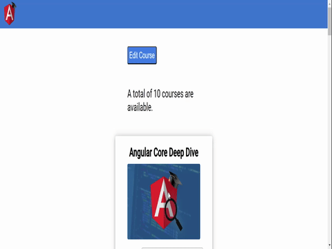

# AngularDeepDiveApp

This project was generated with [Angular CLI](https://github.com/angular/angular-cli) version 17.0.7. It contains some pratices viewed on the [Angular Core Deep Dive](https://angular-university.io/course/angular-course) course.

  

## Development server

Run `ng serve` for a dev server. Navigate to `http://localhost:4200/`. The application will automatically reload if you change any of the source files.

 # To Run the Development Backend Server

In order to use the consult and save services implemented on the code to retrive data and save the new card title, it will need raise a small REST API backend server. We can start the sample application backend with the following command:

    npm run server

This is a small Node REST API server.

## Build

Run `ng build` to build the project. The build artifacts will be stored in the `dist/` directory.

## Running unit tests

Run `ng test` to execute the unit tests via [Karma](https://karma-runner.github.io).

## Running end-to-end tests

Run `ng e2e` to execute the end-to-end tests via a platform of your choice. To use this command, you need to first add a package that implements end-to-end testing capabilities.

## Further help

To get more help on the Angular CLI use `ng help` or go check out the [Angular CLI Overview and Command Reference](https://angular.io/cli) page.
